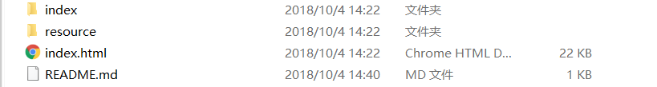
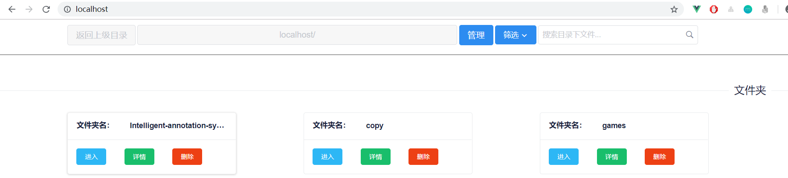

# smhhyyz-index

自己写的用于localhost的index界面

# 目录结构

- index
  - png文件
  - php文件

- resource
    - 框架
    - css
    - js

- index.html

# 技术栈
 - html
 - css
 - js

# 感谢以下框架和开源插件
- Vue.js
- iView
- JQuery
- SweetAlert 2
# 使用方法
- 将所有文件和文件夹放在服务器根目录下即可
 
 

# BUG汇总
- 文件夹的分类有问题
- 名为.xxx的文件夹，无法读取大小等信息